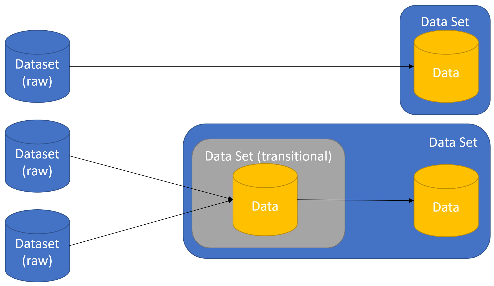
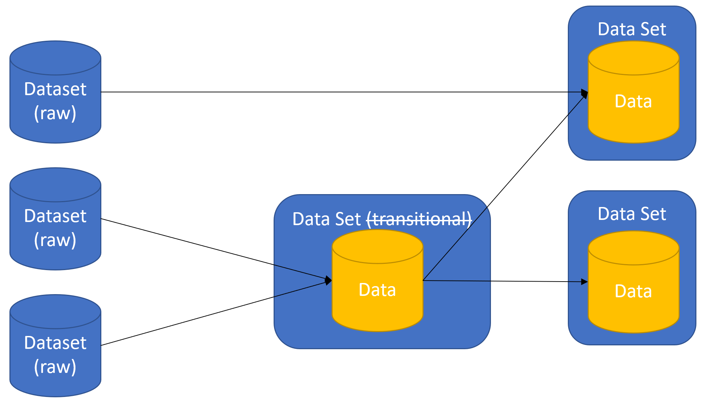

# DatalakeDocs

Data lake documentation and opinions

## Storage Accounts

The first question to address in a data lake is how many storage accounts you'll need, and what type of accounts to use.

### Account Types

On Azure, you have four options for your data lake storage:

* Bring your own
* Blob Storage
* Azure Data Lake Store Gen 2
* Azure Data Lake Store Gen 1

The bring your own option could involve connecting to existing storage elsewhere, or it could involve deploying an appliance or virtual machine cluster on to Azure infrastructure. This type of storage allows for maximum flexibility but at the same time will raise costs and management/maintenance and so is the least preferred option. Unless you have a good reason to do this, don't do it.

Azure Data Lake Storage Gen 1 is an HDFS implementation managed by Microsoft, and uses special hardware within the Azure data centres. While this option will continue to work well in situations where you need HDFS for some reason. Cost and availability are two reasons you may want to try to use other services, since this is not globally in all data centres. This has also been superseded by ADLS Gen 2 which, although a completely different offering, is generally compatible in most of the same scenarios.

Blob and ADLS Gen 2 use the same underlying services but have different costs and capabilities. The main difference is that of hierarchies, also referred to as folders. While blob storage offers virtual folders, these do not allow file operations against them. What this means in practice, is that on ADLSg2 renaming a folder will use a single file operation against the file system while on Blob the same action will use one operation for every file in the virtual folder. Since each operation takes several milliseconds, this can add up to a lot of time overall for large folders. Since that time means your expensive cluster will need to remain on it could be very expensive to use Blob in situations where you are processing data. For reference, many big data operations will write data to a temporary folder and rename it at the end, so this will happen in most scenarios where you're transforming data.

As a general rule, new raw data coming in should go to Blob Storage which will allow it to utilise storage tiering to reduce costs while also being performant enough for most use cases raw data will need.

Modified data will generally be stored on ADLS Gen 2 since hierarchies will ensure best performance while processing.

### Number of Accounts

## Structure

Many documents discuss using layers in the data lake to organise data. You'll often see concepts of "bronze, silver, gold", or "raw, curated, modelled". I find that these concepts, while useful to explain data lakes to beginners, don't convey the real requirements or purpose of structure within a lake. Leaving aside the obvious structural concepts of dates and data sources for the moment, structure needs to reflect organisational requirements. For this reason, my preferred explanation fits around data sets.

### Data sets

A data set must have an owner. This seems obvious since every other concept in IT includes an owner. Someone should be responsible for:

* Data Lifecycle Management
* Compliance
* Availability
* Transformation of data
* Data Delivery Contract
* Access Control

Data sets will be created from raw data and/or other data sets. Raw data should also be thought of as data sets, and include all of the ownership and management discussed above. Where data is transformed, but does not constitute a deliverable data set on its own (i.e. does not include a data delivery contract of its own) it should be considered a transitional data set which belongs within the data set consuming it.

This, in turn, enables us to pull the transitional data set out later and promote it to full data set if a second use case is found to consume it. This is analogous to the idea of silver or curated in other documentation, but it should be noted that this is not a function of the lake, or a layer on the lake but of a data set itself.

